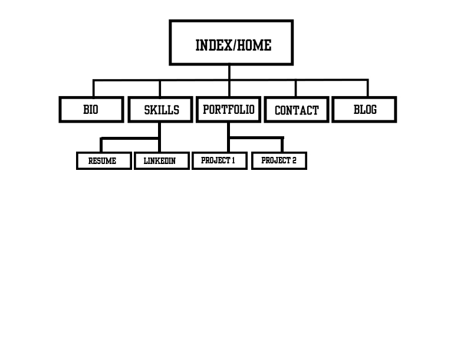

1. What are the 6 Phases of Web Design?
	
	a. Gathering Information
	b. Planning
	c. Design
	d. Development
	d. Testing and Delivery
	e. Maintenance

2. What is your site's primary goal or purpose? What kind of content will your site feature?
	
	The primary goal for my site will be to give information to prospective employers of my personality and skillset. I will display things such as a personal bio, my interests, my resume and skillset, as well as examples of my work.

3. What is your target audience's interests and how do you see your site addressing them?
	
	Like I said in question 2, my target audience will be prospective employers. They will be interested in seeing my skillset as well as how well I work with other people. They will also want to see examples of the work I have done. My site will address all of these in their own links/pages on the site.

4. What is the primary "action" the user should take when coming to your site? Do you want them to search for information, contact you, or see your portfolio? It's ok to have several actions at once, or different actions for different kinds of visitors.
	
	I plan on making a very clean and easy to use site. My goal is for potential employers to want to contact me regarding employment. For that reason I plan on having my contact information clearly displayed at the bottom of each page within the site. Whether they are looking at my bio, resume, or portfolio, they will be one click away from contacting me and will not have to "search" the site for that information.

5. What are the main things someone should know about design and user experience?

	In my opinion, when it comes to design user expereince, things should be clean, well organized, and easy to navigate. The site MUST be pleasing to the eye. If a site is cluttered, unorganized or unpleasant to look at, people will be discouraged to return to it. Furthermore, the site needs to be accessable from various devices, browsers, and internet connectons. A desktop version of a site my be too large to easily view on the screen of a smartphone and take too much bandwidth to properly/quickly load. 	

6. What is user experience design and why is it valuable? 

	User experience design is the focus web designers have on how a site runs and how its users use it. It is the goal of the web designer to provide the user with a positive experience where they can easily and effectively whatever it maybe that they are seeking.

7. Which parts of the challenge did you find tedious?

	The most tedious part of this challenge was getting the image file to display in the file.