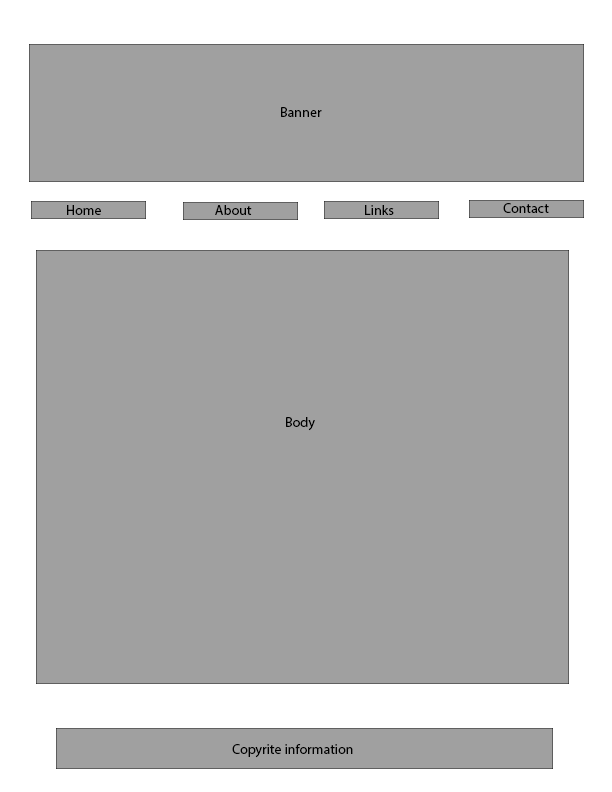

1. What is a wireframe?
	
	A Wireframe is basically a layout or floor plan for the way a webpage is to be set up.

2. What are the benefits of wireframing?
	
	It gives the web designer/developer a visual representation of what the site will look like when finished. It is almost like a rough draft for piece of writing.

3. Did you enjoy wireframing your site?
	
	Yes, I have expereince in art/drawing and have done similar things to this in the past. I also found it to be similar to the writing process where you write a "rough draft." 

4. Did you revise your wireframe or stick with your first idea?
	
	I stuck with my first idea. I already had a pretty good idea of what I wanted the pages to look like.

5. What questions did you ask during this challenge? What resources did you find to help you answer them?
	
	I actually taught a webdesign and photoshop class previously so I was pretty effecient when doing the wireframe and did not need any additional resources.

6. Which parts of the challenge did you enjoy and which parts did you find tedious?
	
	I enjoyed creating the wireframe on photoshop. I am a very visual person so I liked being able to draw out a rough idea of what the pages were going to look like before hand. 

	I found that sometimes the directions were a bit confusing and unclear. I had to read over them a few times to get what it was trying to say/explain.

