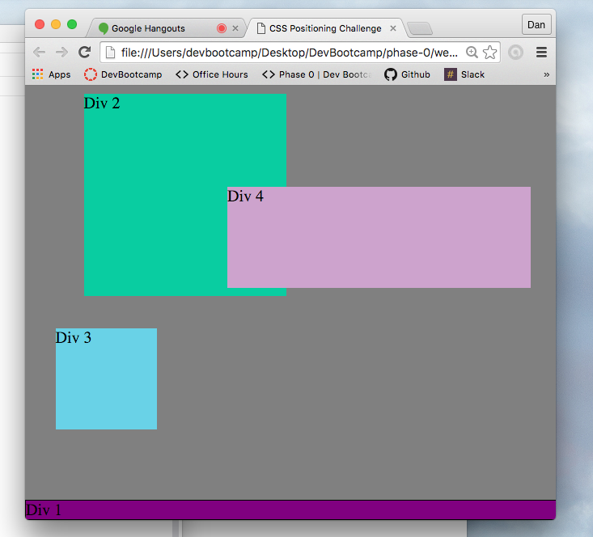

#How can you use Chrome's DevTools inspector to help you format or position elements?#

	It allows you as the designed/inspector to quickly see what minor CSS changes would look like instantly without having to modify actual code. This is helpful and safe because it eliminates the possibilty of overwriting correct code with mistakes, while experimenting with design elements.

#How can you resize elements on the DOM using CSS?#

	It can be done several ways. First in relative terms via percentages of biv space. Second in absolute terms in actual amount of px. Height and width can be adjusted in these ways.

#What are the differences between absolute, fixed, static, and relative positioning? Which did you find easiest to use? Which was most difficult?#

	Absolute 
		- Exact placement with respect to the web browser.

	Fixed 
		- Exact placement in a set location. When scrolling the object will remain in the same place regardless of what section of the page is being viewed.

	Static
		- Object is in a set place and scrolls with all other objects on the page.

	Relative
		- Placement is relative to the place where it is supposed to be.

#What are the differences between margin, border, and padding?#

		- Margin is external to the div/element itself and transparent.
		- Border is the actual edge of the div/element.
		- Padding is space inside of the border of the div/element.
			Content will not overlap with the padding inside of a div/element.

#What was your impression of this challenge overall? (love, hate, and why?)#

	- I enjoyed the challenge itself. It showed a very useful and effective tool when using CSS. However, I found the trial and error process to be very time consuming and frustrating. Some of the tasks were very simple to complete, but through the trial and error process became much more difficult than need be.

